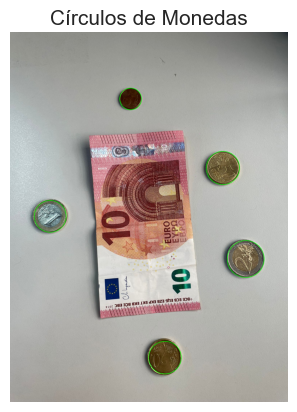
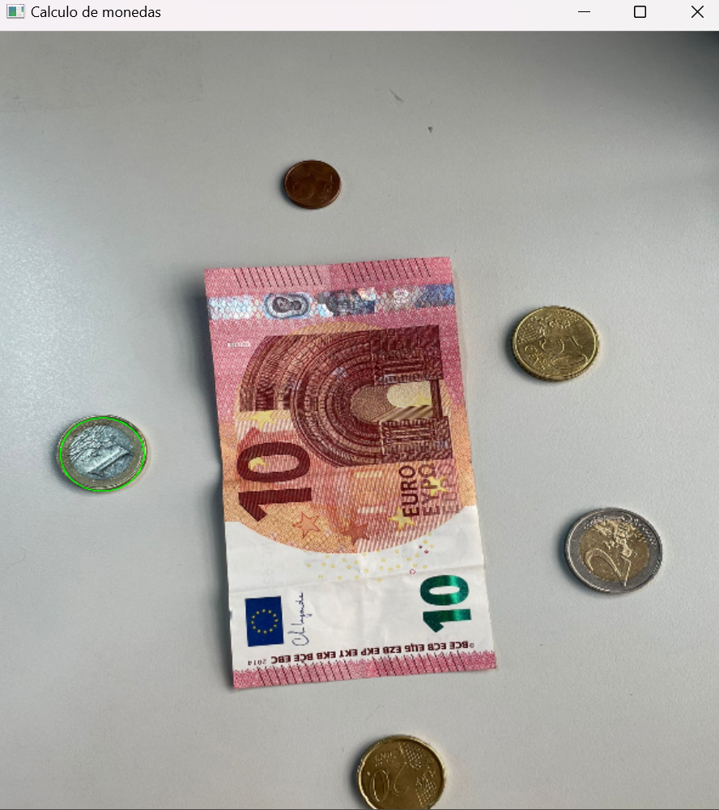
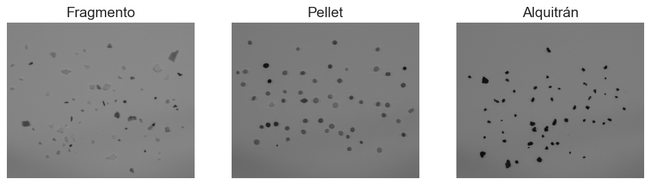
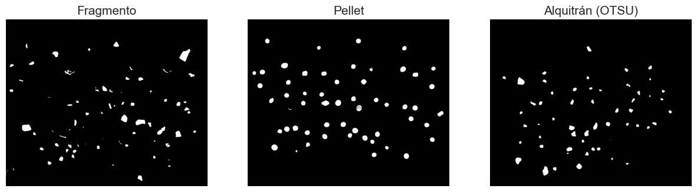
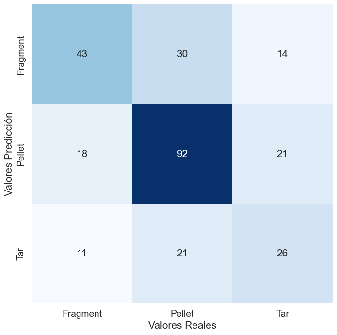

## Práctica 3. Detección de formas

En esta tercera práctica se plantean tres nuevas tareas. Las dos primeras están relacionadas con el recuento de monedas. En la primera tarea, se debe identificar cuántas monedas se detectan en la imagen, mientras que en la segunda, se busca determinar la cantidad total de dinero representada en la imagen. Finalmente, se utilizarán las herramientas empleadas en las tareas anteriores con el fin de llevar a cabo una clasificación lo más precisa posible de diferentes tipos de microplásticos (fragmentos, pellets y alquitrán).

## Autores

## Tecnologias
  -  Python: 

## Librerias 
  - OpenCV: 
  - Matplotlib: 
  - NumPy: 
  - Seaborn: 
  - scikit-learn (sklearn): 

Se debe destacar que para poder usar las librerías "seaborn" y "Scikit-learn", estas deben ser instaladas en el *environment* utilizado en las prácticas y desde el **Anaconda Prompt** con la instrucción *pip install (nombre_librería)*.

## Índice

1. [Total de monedas](#total-de-monedas)
2. [Cantidad de dinero](#cantidad-de-dinero)
3. [Microplásticos](#microplásticos)
4. [Conclusión](#conclusión)

## Total de monedas

En el siguiente ejercicio, se trataba de sacar una foto que incluyera monedas no solapadas y otro objeto, teníamos que contar la cantidad de monedas que había en la imagen. En nuestro caso, optamos por crear una imagen que tuviera tanto monedas como un billete. A continuación, realizamos las siguientes operaciones:

- Convertimos la imagen a formato RGB y la transformamos a escala de grises.

- Utilizamos el algoritmo HoughCircles de OpenCV para detectar los círculos en la imagen, ajustando parámetros como el valor del gradiente y los radios mínimo y máximo.

- Una vez que el algoritmo reconoce las monedas en la imagen, procedemos a contarlas y devolver el número total de monedas presentes.

A continuación, se muestra el resultado de la detección de monedas en la imagen:

## Cantidad de dinero

En el siguiente segmento, empleamos dos imágenes: 'dinero.jpg', utilizada previamente, y 'Solapadas.jpg', que presenta monedas superpuestas. El objetivo es detectar la moneda de 1€ y, al hacer clic, calcular la cantidad total de dinero en la imagen.

Para empezar, convertimos la imagen al formato RGB para asegurarnos de que se visualice correctamente y luego la transformamos a escala de grises. Posteriormente, procedemos a la detección de círculos en la imagen, utilizando el mismo método que en el ejercicio anterior.

Verificamos si se han identificado círculos en la imagen y, en caso afirmativo, iteramos a través de ellos. Para cada círculo detectado, definimos una Región de Interés (ROI) alrededor de él. Calculamos la relación de aspecto de esta ROI para determinar si corresponde a una moneda. Dependiendo del tamaño del radio del círculo, sumamos un valor al "total". Las monedas se reconocen en función de su diámetro aproximado.

Finalmente, redimensionamos la imagen resultante y la mostramos en una ventana de visualización. También hemos implementado una función para manejar clics en la imagen resultante. Al hacer clic en la imagen, se muestra la cantidad total de monedas detectadas en la imagen.

Es importante mencionar que con la segunda imagen, en la que se encuentran las monedas solapadas, no funcionó correctamente debido a que el algoritmo HoughCircles no es capaz de dectectar media circuferencias o circuferencias que esten inclinadas.

## Microplásticos

Este ejercicio final, se trata de generar una matriz de confusión a partir de imágenes de microplásticos. El proceso incluye cargar, procesar y mostrar tres imágenes de microplásticos en escala de grises, con el objetivo de eliminar sombras y aplicar un filtro de suavizado a las imágenes.

Luego, se procede a segmentar las regiones de interés en las imágenes y destacar las áreas de mayor relevancia. Se han ajustado los valores de umbral para lograr la segmentación deseada.

Para concluir el ejercicio, se cuenta el número de imágenes y se clasifican los elementos en tres categorías distintas. Los resultados se visualizan a través de una matriz de confusión.

## Conclusión

Estos ejercicios ilustran una variedad de técnicas de procesamiento de imágenes. Desde la detección y conteo de monedas en una imagen hasta la clasificación de elementos en imágenes de microplásticos, cada uno de los tres ejercicios demuestra cómo se pueden aplicar métodos y algoritmos de procesamiento de imágenes para propósitos específicos. Ofrecen una visión completa de cómo abordar diversas tareas de procesamiento de imágenes, desde la detección de objetos hasta la segmentación y clasificación, lo que resalta la versatilidad y la aplicabilidad de estas técnicas en diversos contextos y aplicaciones.

## Bibliografía

1. [Matriz de Confusión](https://pythonguia.com/scikit-aprende-matriz-de-confusion/)