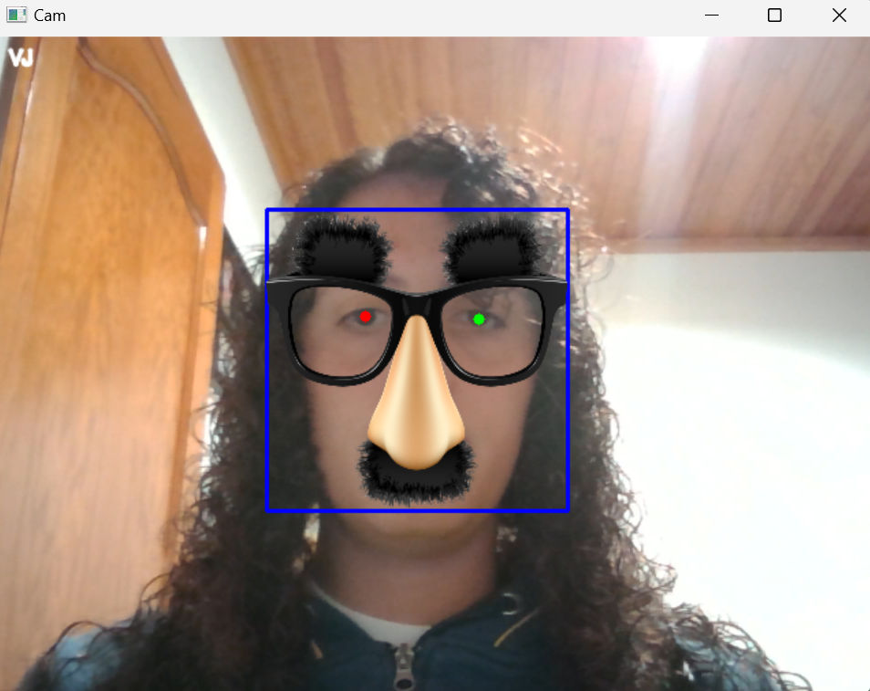

## Práctica 4. Detección de caras

En esta cuarta práctica, se propone la creación de un filtro que detecta nuestro rostro. Hicimos dos filtros: en el primero, superponemos una imagen en nuestro rostro, mientras que en el segundo filtro, detectamos los ojos y aplicamos un efecto de desenfoque a los mismos.

## Autores

## Tecnologias
  -  Python: 

## Librerias 
  - OpenCV: 
  - FaceNormalizationUtils: 
  - time: 
  - FaceDetectors: 

## Índice

1. [Primer filtro](#primer-filtro)
2. [Segundo filtro](#segundo-filtro)

## Primer filtro

El primer filtro se encuentra en el archivo "VC_P4.ipynb". Este filtro carga una imagen y se ajusta su tamaño para que coincida con el tamaño de la cara detectada. Si el filtro tiene un canal alfa (RGBA), se realiza una mezcla de canales para combinar el filtro con la imagen de la cara teniendo en cuenta la transparencia. Si no tiene un canal alfa (es una imagen RGB), se utiliza un método de mezcla ponderada.

## Segundo filtro

El segundo filtro se encuentra en el archivo "VC_P4_deepface.ipynb". Este filtro utiliza la clase "FaceDetector", que incluye un método denominado "DetectLargestFaceEyesDNN" diseñado para la detección de caras y ojos. Una vez que se ha detectado una cara y los ojos, se procede a dibujar un rectángulo alrededor de la cara, creando también una región correspondiente a los ojos. A continuación, aplicamos un efecto de desenfoque gaussiano a la región de los ojos con el fin de lograr un efecto de desenfoque atractivo. Finalmente, reemplazamos la región de los ojos previamente difuminada en la imagen original.

