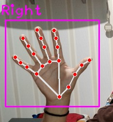
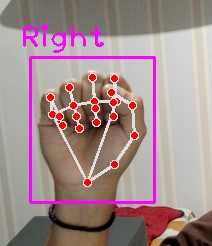
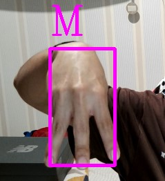
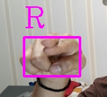
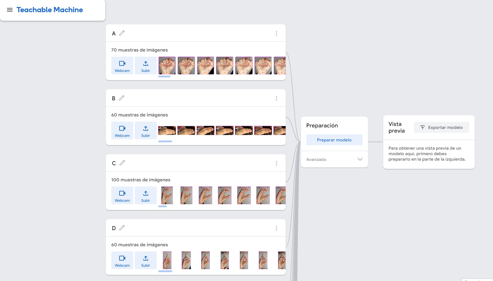

## Práctica 7. Trabajo de curso

Este repositorio contiene código en Python para el reconocimiento de gestos manuales utilizando la biblioteca OpenCV y el módulo cvzone. El sistema está diseñado para detectar gestos manuales en tiempo real a través de una cámara web y capturar imágenes de posturas específicas de las manos para entrenar un modelo de clasificación de gestos. 
 
 ## Contenido

 - **dataCollection.py**: Este script captura posturas de manos en tiempo real utilizando la cámara web, recorta y redimensiona la región de la mano, y guarda las imágenes para entrenar un modelo.

- **test.py**: Este script utiliza el modelo entrenado para realizar el reconocimiento de gestos manuales en tiempo real. Captura posturas de manos, preprocesa las imágenes y predice los gestos correspondientes utilizando un modelo de clasificación preentrenado.

## Autores

 ## Estructura de archivos:
 - **/Trabajo de curso/Model/keras_model.h5:** Modelo preentrenado de Keras para la clasificación de gestos manuales.

- **/Trabajo de curso/Model/labels.txt:** Archivo de texto que contiene las etiquetas correspondientes a los gestos manuales.

- **/C:/Users/Lenovo/Desktop/Data/Y:** Carpeta predeterminada para guardar las imágenes de posturas de manos capturadas. Puedes modificar la variable 'folder' en ambos scripts para cambiar la ubicación de almacenamiento.

 ## Uso
 - **1. dataCollection.py:**
    - Ejecuta el script para abrir la transmisión de la cámara web.
    - Coloca tu mano dentro del encuadre de la cámara y presiona la tecla 'S' para capturar y guardar una imagen de la postura de tu mano.
    - Repite el proceso para diferentes posturas de mano para recopilar un conjunto de datos diverso.
    - Presiona 'Q' para salir de la aplicación.

    <!-- Fila 1 -->
    

        
        
    

&nbsp;

 - **2. test.py:**
    - Ejecuta el script para abrir la transmisión de la cámara web y realizar el reconocimiento de gestos manuales en tiempo real.
    - El gesto predicho se mostrará en la pantalla, junto con un cuadro delimitador alrededor de la mano detectada.
    - Presiona 'Q' para salir de la aplicación.

    <!-- Fila 1 -->
    

        
        
    

    

        
        
    

    

 ## Entrenamiento del modelo
 Para entrenar el modelo que se encuentran dentro de este repositorio, se ha hecho utilizando [Teachable Machine](https://teachablemachine.withgoogle.com/)

    

        
    

## Tecnologias
  -  [Python](https://img.shields.io/badge/Python-3.x-blue?style=flat-square&logo=python)
  - [TensorFlow](https://www.tensorflow.org/?hl=es-419)

## Librerias 
- [cvzone](https://pypi.org/project/cvzone/)
- [NumPy](https://numpy.org/)
- [Math](https://docs.python.org/3/library/math.html)
- [Time](https://docs.python.org/es/3/library/time.html)