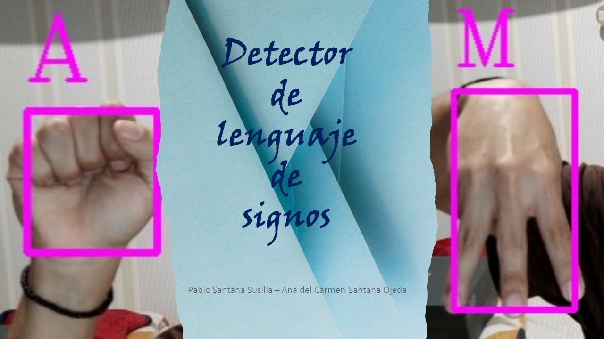

## Trabajo de Curso: Detector de lenguaje de signos

Este repositorio contiene código en Python para el reconocimiento de gestos manuales utilizando la biblioteca OpenCV y el módulo cvzone. El sistema está diseñado para detectar gestos manuales en tiempo real a través de una cámara web y capturar imágenes de posturas específicas de las manos para entrenar un modelo de clasificación de gestos. 

    <!-- Fila 1 -->
    

        
    

## Autores

## Motivación

Este proyecto se origina con la firme intención de brindar un aporte valioso a la sociedad, especialmente en favor de aquellos individuos que enfrentan desafíos en la comunicación, como es el caso de las personas con discapacidad auditiva o sordera. En este sentido, la herramienta desarrollada no solo busca asistir a quienes requieren comunicarse en lenguaje de signos, sino también servir como una valiosa herramienta de aprendizaje para aquellos que deseen adquirir habilidades en este sistema de expresión.

La aplicación no solo cumple una función asistencial al facilitar la comunicación para aquellos que enfrentan limitaciones auditivas, sino que también se presenta como una plataforma educativa. Su utilidad se extiende a aquellos individuos que desean aprender el abecedario en lenguaje de signos, proporcionando una experiencia interactiva y didáctica para adquirir estas habilidades comunicativas específicas.

En resumen, la motivación subyacente en este proyecto es abordar la necesidad de facilitar la comunicación para personas con discapacidad auditiva, al mismo tiempo que se ofrece una herramienta educativa para aquellos que buscan aprender y comprender el abecedario en lenguaje de signos. Este enfoque amplio refleja el compromiso de la iniciativa con la inclusión y la accesibilidad universal.

## Objetivo

El objetivo de este trabajo consiste en diseñar un sistema de detección de gestos manuales en tiempo real mediante una cámara web y capturar imágenes de posturas específicas de las manos para la clasificación de gestos.
 
 ## Contenido

 - **dataCollection.py**: Este script captura posturas de manos en tiempo real utilizando la cámara web, recorta y redimensiona la región de la mano, y guarda las imágenes para entrenar un modelo.

- **test.py**: Este script utiliza el modelo entrenado para realizar el reconocimiento de gestos manuales en tiempo real. Captura posturas de manos, preprocesa las imágenes y predice los gestos correspondientes utilizando un modelo de clasificación preentrenado.

 ## Estructura de archivos:
 - **/Trabajo de curso/Model/keras_model.h5:** Modelo preentrenado de Keras para la clasificación de gestos manuales.

- **/Trabajo de curso/Model/labels.txt:** Archivo de texto que contiene las etiquetas correspondientes a los gestos manuales.

- **/C:/Users/Lenovo/Desktop/Data/Y:** Carpeta predeterminada para guardar las imágenes de posturas de manos capturadas (en este caso, para guardar las imágenes del gesto que representan la letras 'Y'). Puedes modificar la variable 'folder' en ambos scripts para cambiar la ubicación de almacenamiento.

 ## Uso
 - **1. dataCollection.py:**
    - Ejecuta el script para abrir la transmisión de la cámara web.
    - Coloca tu mano dentro del encuadre de la cámara y presiona la tecla 'S' para capturar y guardar una imagen de la postura de tu mano.
    - Repite el proceso para diferentes posturas de mano para recopilar un conjunto de datos diverso.
    - Presiona 'Q' para salir de la aplicación.

    <!-- Fila 1 -->
    

        
        
    

&nbsp;

 - **2. test.py:**
    - Ejecuta el script para abrir la transmisión de la cámara web y realizar el reconocimiento de gestos manuales en tiempo real.
    - El gesto predicho se mostrará en la pantalla, junto con un cuadro delimitador alrededor de la mano detectada.
    - Presiona 'Q' para salir de la aplicación.

    <!-- Fila 1 -->
    

        
        
    

    

        
        
    

    

 ## Entrenamiento del modelo
 Para entrenar el modelo que se encuentran dentro de este repositorio, se ha hecho utilizando [Teachable Machine](https://teachablemachine.withgoogle.com/)

    

        
    

## Aspectos a mejorar

Una de las áreas identificadas para mejorar en este proyecto es el entrenamiento del modelo de clasificación. La precisión del modelo puede verse afectada por condiciones variables de iluminación en el entorno. En situaciones donde la iluminación es baja o cambia significativamente, es posible que algunas letras se confundan, lo que podría afectar la precisión de las predicciones. 

## Propuestas Adicionales

1. Detección de palabras específicas

Ampliar la funcionalidad para detectar palabras específicas o comandos, lo que permitiría realizar acciones específicas al reconocer ciertos gestos.

2. Compatibilidad con otros idiomas

Adaptar el modelo para reconocer gestos asociados con el lenguaje de señas de diferentes idiomas, ampliando así su utilidad y alcance cultural.

3. Alertas de confianza

Implementar alertas visuales o auditivas cuando el modelo tenga baja confianza en la clasificación de un gesto, indicando al usuario que puede necesitar repetir el gesto de manera más clara.

## Conclusión

En síntesis, hemos concebido una herramienta que no solo detecta los gestos manuales, sino que también busca fomentar la inclusión y la accesibilidad tecnológica.

Sostenemos la convicción de que el acceso a la tecnología debería ser un derecho universal, y este proyecto representa un modesto avance hacia la concreción de ese ideal.

## Tecnologías
  - [Python](https://img.shields.io/badge/Python-3.x-blue?style=flat-square&logo=python)
  - [TensorFlow](https://www.tensorflow.org/?hl=es-419)

## Librerías 
- [cvzone](https://pypi.org/project/cvzone/)
- [NumPy](https://numpy.org/)
- [Math](https://docs.python.org/3/library/math.html)
- [Time](https://docs.python.org/es/3/library/time.html)

## Bibliografía 
- [Sign language detection with Python and Scikit Learn](https://youtu.be/MJCSjXepaAM?si=vATFcch069Fc9CAU)
- [Real-Time Hand Gesture Recognition with Mediapipe and Tensorflow](https://youtu.be/0W4nRBPu1hQ?si=W3q77MiM0QZXtXIP)
- [@python.hub](https://www.instagram.com/p/C1RG_jarISG/)
